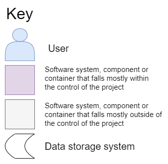

# Architecture diagrams

These diagrams were created using [https://app.diagrams.net](https://app.diagrams.net) and can be edited by using their source files.

They use the C4 model to draw diagrams at different levels, see [https://c4model.com/](https://c4model.com/) for more details.

The following key is used in the diagrams.

